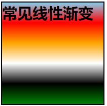
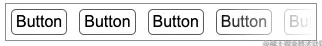
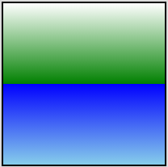
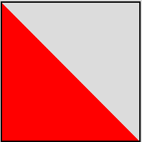
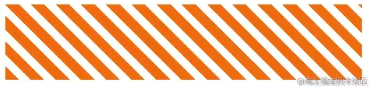

# 背景基础

> CSS background基础部分：纯色背景色或图片、渐变（线性渐变、径向渐变、角向渐变、重复渐变）
>
> * background 是支持多重渐变的叠加的，不仅仅是单一的线性渐变或角向渐变
> * 复杂场景下，灵活使用 `repeating-linear-gradeint`（`repeating-radial-gradeint`），它能减少很多代码量
> * CSS 中存在一种透明色 `transparent` ，在渐变中，学会使用透明色非常重要


## 线性渐变总结

* 渐变的颜色可以是透明色
* 渐变可以是从一种颜色直接到另外一种颜色，不需要有过渡状态
* 渐变是可以叠加多层的
* 利用 repeating-linear-gradient 节省代码，实现片段的重复


## `linear-gradient` 线性渐变

> 常见用法：从一种颜色到另一种颜色（由上至下）

```
{
 background: linear-gradient(skyblue, red, orange, white, black, green);
}
```



### 技巧一：渐变的颜色可以是透明色（transparent）

> 实现一种遮罩效果时，从白色到透明色的渐变，通过叠加在元素上方的方式实现

 案例：列表遮罩效果

```
<div class="g-container">
  <ul>
    <li>Button</li>
    <li>Button</li>
    <li>Button</li>
    <li>Button</li>
    <li>Button</li>
    <li>Button</li>
  </ul>
</div>
```

```
.g-container {
    ...
  
    &::before {
        content: "";
        position: absolute;
        right: 0;
        bottom: 0;
        top: 0;
        width: 100px;
        background: linear-gradient(90deg, transparent, #fff);
    }
}
```



### 技巧二：渐变可以是从一种颜色直接到另外一种颜色

> 渐变不仅可以是渐变过渡，也可以是实色过渡，也就是一个颜色直接过渡到第二种颜色。

基础应用：前 50% 为白色，后 50% 为红色。

```
{
      background: linear-gradient(#fff 0%, green 50%, blue 50%, skyblue 100%);
    }
```



案例：实现一个三角形

```
{
      background: linear-gradient(
        45deg,
        #f00 0%,
        #f00 50%,
        transparent 50%,
        transparent 100%
      );
    }
```



### 技巧三：渐变是可以叠加多层的

案例：内切多边形

```
{
      width: 200px;
      height: 100px;
      background: linear-gradient(45deg, transparent 15px, deeppink 0),
        linear-gradient(135deg, transparent 15px, deeppink 0),
        linear-gradient(-135deg, transparent 15px, deeppink 0),
        linear-gradient(-45deg, transparent 15px, deeppink 0);
      background-size: 50% 50%, 50% 50%, 50% 50%, 50% 50%;
      background-position: bottom left, top left, top right, bottom right;
      background-repeat: no-repeat;
    }
```


### 技巧四：利用 repeating-linear-gradient 节省代码

> 使用repeating-linear-gradient创建一个由线性渐变重复组成的图形   每 11px 安排一段 `#f06a0e`，每 9px 安排一段 `transparent`

```
{
      width: 200px;
      height: 100px;
      border: 1px solid #000;
      background: repeating-linear-gradient(
        45deg,
        #f06a0e,
        #f06a0e 11px,
        transparent 11px,
        transparent 20px
      );
    }
```



等同于：

```
{
    background: 
        linear-gradient(
            45deg, 
            #f06a0e, 
            #f06a0e 11px, 
            transparent 11px, 
            transparent 20px, 
            #f06a0e 20px, 
            #f06a0e 31px, 
            transparent 31px, 
            transparent 40px,
            #f06a0e 40px, 
            #f06a0e 51px, 
            transparent 51px, 
            transparent 60px
        );
}
```
