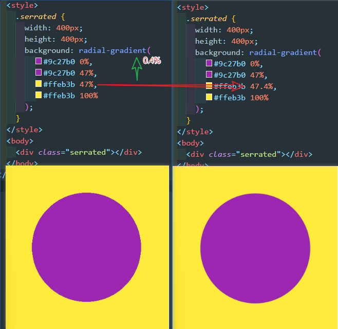

### 径向渐变基础

> 线性渐变的4 个技巧放在径向渐变也是适用的

### 技巧五：预留衔接空间消除渐变产生的锯齿

> 在使用渐变生成不同颜色的直接过渡时，非常容易就会产生锯齿效果

***在衔接处，适当留下一些渐变空间。***

从47% 到 47% 的一个变化，改为了 从 47% 到 47.4%，这多出来的 0.4% 就是为了消除锯齿的.。。。这里的 `0.4%` 不是写死的，需要根据具体使用的情况灵活调试

### 技巧六：利用多层渐变组合图形
