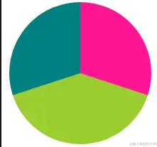

## 角向渐变基础

> `conci-gradient` 角向渐变，在更早之前，它也被翻译成圆锥渐变


#### 与其他渐变的区别

* `linear-gradient` 线性渐变的方向是一条直线，可以是任何角度
* `radial-gradient` 径向渐变是从圆心点以椭圆形状向外扩散
* 角向渐变的起始圆心点、起始角度和渐变方向为 0deg 是从上方垂直于圆心，渐变方向以顺时针方向绕中心实现


#### 实现颜色表盘

> 与另外两个渐变一样，可以实现多颜色的过渡渐变

```
{
    width: 200px;
    height: 200px;
    border-radius: 50%;
    background: conic-gradient(red, orange, yellow, green, teal, blue, purple);
}
```


优化彩虹：

1. 颜色不够丰富明亮
2. 起始和结尾处衔接不自然

> `hsl()` 被定义为色相-饱和度-明度
>
> H: 色彩的基本属性，就是平常所说的颜色名称，如红色、黄色等
>
> S: 指色彩的纯度，越高色彩越纯，低则逐渐变灰，取 0~100% 的数值
>
> V: 亮度（L），取 0～100%

也就是采用这样一个过渡 `hsl(0%, 100%, 50%)` --> `hsl(100%, 100%, 50%)`，中间只改变色相，生成 20 个过渡状态。借助 SCSS ，CSS 语法如下

```
$colors: ();
$totalStops:20;

@for $i from 0 through $totalStops{
    $colors: append($colors, hsl($i *(360deg/$totalStops), 100%, 50%), comma);
}

.colors {
    width: 200px;
    height: 200px;
    background: conic-gradient($colors);
    border-radius: 50%;
}
```


#### 实现饼图

> 更加具体地指定角向渐变每一段的比例， **配合百分比** ，可以很轻松地实现饼图

```
{
    width: 200px;
    height: 200px;
    background: conic-gradient(deeppink 0, deeppink 30%, yellowgreen 30%, yellowgreen 70%, teal 70%, teal 100%);
    border-radius: 50%;
}
```



另一种写法

```
{
    background: conic-gradient(deeppink 0 30%, yellowgreen 0 70%, teal 0 100%);
}
```


#### 配合background-size使用

```
{
    width: 250px;
    height: 250px;
    margin: 50px auto;
    background: conic-gradient(#000 12.5%, #fff 0 37.5%, #000 0 62.5%, #fff 0 87.5%, #000 0);
    background-size: 50px 50px;
}
```


#### 重复角向渐变

```
{
    width: 200px;
    height: 200px;
    background: repeating-conic-gradient(deeppink 0 15deg, yellowgreen 0 30deg);
    border: 1px solid #000;
}
```


#### 配合repeat和position使用

```
div {
    margin: auto;
    width: 200px;
    height: 200px;
    background: conic-gradient(from 270deg at 50px 50px, deeppink 0%, deeppink 90deg, transparent 90deg, transparent 
 360deg);
    background-position: -25px -25px;
    border: 1px solid #000;
}

```


### 利用小单位实现造型迥异的图案

```
{
    background: repeating-conic-gradient(#fff, #000, #fff 0.1deg);
}
```


> Wow，不可思议。这里 `0.1deg` 非常关键，这里的角度越小（小于 1deg 为佳），图形越酷炫，也就是我们说的数量级对背景图形的影响
