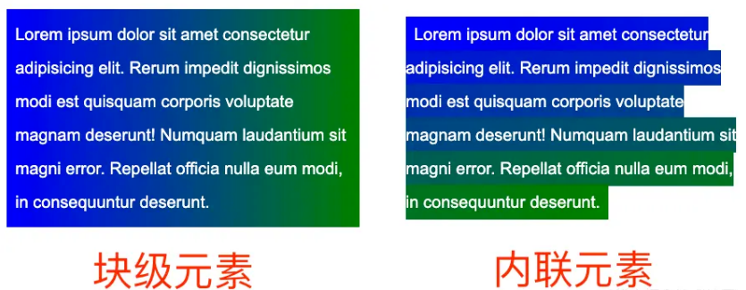
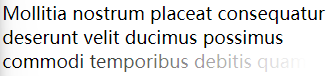

## background 与 display: inline

> 表现为 `display: inline` 内联元素的 `background` 展现形式与 `display: block` 块级元素（或者 `inline-block`、`flex`、`grid`）不一致



一、添加一个 `background-size` 的动画

```
p, a {
    color: #000;
    background: linear-gradient(90deg, blue, green);
    background-size: 100% 100%;
    background-repeat: no-repeat;
    transition: all 1s linear;
}

p:hover ,
a:hover {
    background-size: 0 100%;
}
```

二、多行文本的渐隐消失

> 为了利用到实际的内联元素的 `background` 的特性，我们需要将实际的文本包裹在内联元素 `<a>` 内；
>
> 实际的文本，利用了 `opacity: 0` 进行隐藏，实际展示的文本使用了 `<a>` 元素的伪元素，并且将它的层级设置为 `-1`，目的是让父元素的背景可以盖过它；
>
> `<a>` 元素的渐变为从透明到白色，利用它去遮住下面的实际用伪元素展示的文字，实现文字的渐隐。

```
p {
      position: relative;
      width: 400px;
    }
    a {
      color: transparent;
      background: linear-gradient(
        90deg,
        transparent,
        transparent 70%,
        #fff 100%
      );
      background-repeat: no-repeat;
    }
    a::after {
      content: "Mollitia nostrum placeat consequatur deserunt velit ducimus possimus commodi temporibus debitis quam";
      position: absolute;
      top: 0;
      left: 0;
      color: #000;
      z-index: -1;
    }
```



三、文字hover动效

> 定了 `background: linear-gradient(90deg, #ff3c41, #fc0, #0ebeff)`，但是一开始默认它的 `background-size: 0 3px`，也就是一开始是看不到下划线的，
>
> 当 hover 的时候，改变 `background-size: 100% 3px`，这个时候，就会有一个 `0 3px` 到 `100% 3px` 的变换，也就是一个从无到有的伸展效果。
>
> 这里设定的 `background-position` 是 `0 100%`，如果设定的 `background-position` 是 `100% 100%`，我们可以得到一个反向的效果

```
a {
      background: linear-gradient(90deg, #ff3c41, #fc0, #0ebeff);
      background-repeat: no-repeat;
      background-position: 0 100%;
      background-size: 100% 3px;
      transition: all 1s;
      color: #0ebeff;
      cursor: pointer;
    }
    a:hover {
      color: #000;
      background-size: 0 3px;
    }
```
