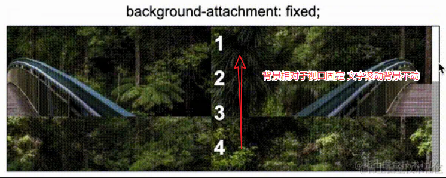

## 冷门属性 `background-attachment`

> `background-attachment`：如果指定了 `background-image` ，那么 `background-attachment` 决定背景是在视口中固定的还是随着包含它的区块滚动的。

##### `background-attachment: scroll`

> **scroll** 此关键字表示背景相对于元素本身固定， 而不是随着它的内容滚动


##### `background-attachment: local`

> **local** 此关键字表示背景相对于元素的内容固定。如果一个元素拥有滚动机制，背景将会随着元素的内容滚动，并且背景的绘制区域和定位区域是相对于可滚动的区域而不是包含它们的边框


##### `background-attachment: fixed`



##### scroll VS fixed

> 有点类似 `position` 定位的 `absolute` 和 `fixed`; 如果我们拖动视口，会发现 ***fixed*** 的背景图在变化而 **scroll** 的不变


##### 使用 `background-attachment` 实现滚动视差

> **区域在变换，但是区域内的图片都是基于视口左上角进行定位的，视觉上造成了一种视差效果** ！
>
> 1. 背景图都设定了 `background-attachment: fixed`，所以背景图都是相对页面视口进行定位的。
> 1. 通过滚动操作，改变的其实是不同的 `<section>` 在视口内的展示区域，通过这个区域的改变，这个区域内的背景图逐渐展现。

```
section {
      height: 100vh;
      background: rgba(0, 0, 0, 0.7);
      line-height: 100vh;
    }
    .g-img1 {
      background-image: url("https://picsum.photos/1200/1000?random=1");
      background-attachment: fixed;
    }
    .g-img2 {
      background-image: url("https://picsum.photos/1200/1000?random=5");
      background-attachment: fixed;
    }
    .g-img3 {
      background-image: url("https://picsum.photos/1200/1000?random=10");
      background-attachment: fixed;
    }
```


##### 使用 `background-attachment` 实现滚动阴影

> 遮罩层（`background-attachment: local`）为白色，再把固定不动的阴影层（`background-attachment: scroll`），利用径向渐变模拟为我们想要的阴影颜色
