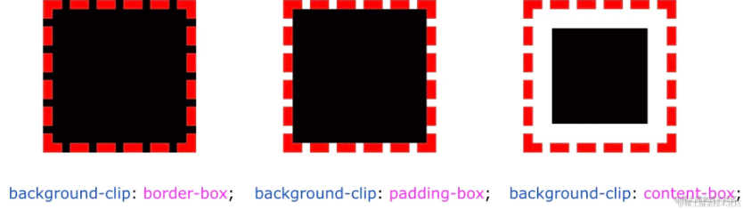
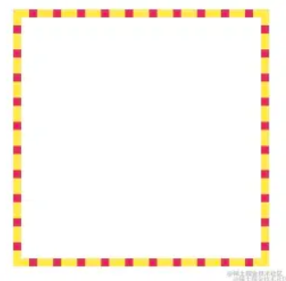
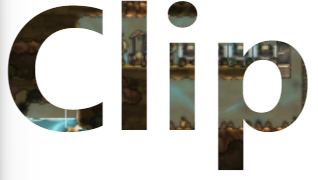

## `background-clip`与渐变文字


##### background-clip基本用法

> `background-clip` 的作用就是 **设置元素的背景（背景图片或颜色）的填充规则** 。
>
> 取值：
>
> * background-clip: border-box;  // 背景延伸到边框外沿（但是在边框之下）
> * background-clip: padding-box; // 边框下面没有背景，即背景延伸到内边距外沿。
> * background-clip: content-box; // 背景裁剪到内容区 (content-box) 外沿。
> * backgrounc-clip: text;



实现一个红黄相间的边框



> 不支持写成 `background: #fff, #e91e63`，所以将第一重白色写成了 `linear-gradient(#fff, #fff)`，它其实等价于 `#fff`

```
div {
      width: 300px;
      height: 300px;
      border: 5px dashed #ffeb3b;
      background: linear-gradient(#fff, #fff), #e91e63;
      background-clip: padding-box, border-box;
    }
```

##### 必须掌握的 `background-clip: text`

> `-webkit-background-clip:text` 属性的意思是，以区块内的文字作为裁剪区域向外裁剪，文字的背景即为区块的背景，文字之外的区域都将被裁剪掉。

一、基础使用

```
  div {
      font-size: 180px;
      font-weight: bold;
      color: deeppink;
      background: url("../image/005.png") no-repeat center center;
      background-size: cover;

      color: transparent;
      background-clip: text;
      -webkit-background-clip: text;
    }
```



二、渐变色文字

```
div {
    font-size: 54px;
    color: transparent;
    background: linear-gradient(45deg, #ffeb3b, #009688, yellowgreen, pink, #03a9f4, #9c27b0, #8bc34a);
    background-clip: text;
}
```


三、带动画的渐变字体

> 配合上面的渐变色动画技巧

```
div {
      font-size: 54px;
      color: transparent;
      background: linear-gradient(
        90deg,
        #ffeb3b,
        #009688,
        yellowgreen,
        pink,
        #03a9f4,
        #9c27b0,
        #8bc34a
      );
      background-clip: text;
      -webkit-background-clip: text;
      animation: identifier 10s infinite alternate;
    }
    @keyframes identifier {
      100% {
        filter: hue-rotate(360deg);
      }
    }
```

四、文字高光动画

```
<p data-text="Lorem ipsum dolor"> Lorem ipsum dolor </p>

p {
    position: relative;
    color: transparent;
    background-color: #E8A95B;
    background-clip: text;
}
p::after {
    content: attr(data-text);
    position: absolute;
    left: 0;
    top: 0;
    width: 100%;
    height: 100%;
    background-image: linear-gradient(120deg, transparent 0%, transparent 6rem, white 11rem, transparent 11.15rem, transparent 15rem, rgba(255, 255, 255, 0.3) 20rem, transparent 25rem, transparent 27rem, rgba(255, 255, 255, 0.6) 32rem, white 33rem, rgba(255, 255, 255, 0.3) 33.15rem, transparent 38rem, transparent 40rem, rgba(255, 255, 255, 0.3) 45rem, transparent 50rem, transparent 100%);
    background-clip: text;
    background-size: 150% 100%;
    background-repeat: no-repeat;
    animation: shine 5s infinite linear;
}
@keyframes shine {
        0% {
                background-position: 50% 0;
        }
        100% {
                background-position: -190% 0;
        }
}
```
