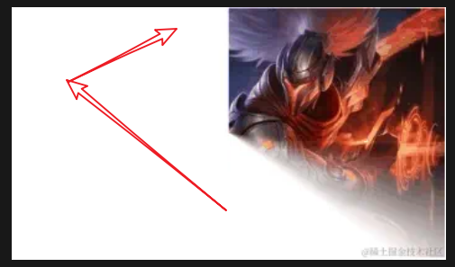

我们之前做过一种效果，如果我们可以动态改变 `mask: linear-gradient(45deg, #000 40%, transparent 60%)`中的 `40%` 和 `60%` 的值，是否就能得到一种动态变换的效果呢？


> ***渐变* **是不支持直接的动画效果的。
>
> 因此，我们需要对 `mask: linear-gradient(xxxx)` 一帧一帧地控制
>
> **@keyframes** maskChange {
> **  **0%** {**
> **    **mask**: **linear-gradient**(**45deg**, **#000** **0%**, transparent **5%**, transparent **5%**);**
> **  }**
> **  **1%** {**
> **    **mask**: **linear-gradient**(**45deg**, **#000** **1%**, transparent **6%**, transparent **6%**);**
> **  }**
> **  ...**
> **  **100%** {**
> **    **mask**: **linear-gradient**(**45deg**, **#000** **100%**, transparent **105%**, transparent **105%**);**
> **  }**


##### 尝试使用 conic-gradient() 实现内容切换动画

> 原理也很简单，不断改变 mask 中 `conic-gradient()` 的参数即可

```
@keyframes maskChange {
    @for $i from 0 through 100 { 
        #{$i}% {
            mask: conic-gradient(
                #000 0, 
                #000 #{$i - 10 + '%'}, 
                transparent #{$i + '%'}, 
                transparent 100%
            );
        }
    }
}
```




##### 使用 CSS @property 简化代码

> 上述功能的实现，虽然经过SASS/LESS 简化，但是编译后还是有太多的代码，并不优雅。

> CSS @property，允许我们显式地定义他们的 CSS 自定义属性，允许进行属性类型检查、设定默认值以及定义该自定义属性是否可以被继承

> 对整个 mask 的动画变换，转移到对变化的变量 `--per`的动画

```
@property --per {
  syntax: "<percentage>";
  inherits: false;
  initial-value: -10%;
}

div {
  width: 300px;
  height: 180px;
  background: url("./img/1.jpg");
  position: relative;
  mask: conic-gradient(
    #000 0,
    #000 var(--per),
    transparent calc(var(--per) + 10%),
    transparent
  );
  animation: maskChange 1.2s ease-in-out infinite;
}
@keyframes maskChange {
  from {
    --per: -10%;
  }
  to {
    --per: 100%;
  }
}
```
