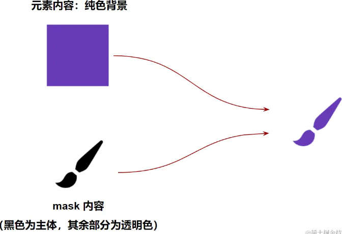

## 使用 mask 实现转场动画

> mask 还可以使用 `SVG`、`图片` 作为遮罩内容
>
> 使用图片作为遮罩的效果的原理：
>
> **图片的实色部分与元素内容叠加的部分将可见，图片透明部分与元素内容的叠加部分将不可见。**



##### 在 mask 中利用多图切换实现转场动画


> 按照逐帧动画 `steps()` ，去切换每一帧的 mask 图片内容

```
<div class="g-container">
    <div class="img1"></div>
    <div class="img2"></div>
</div>

.img1 {
    background: url(https://s.newtalk.tw/album/news/111/5a558de0a141b.jpg);
}
.img2 {
    background: url(https://estnn.com/wp-content/uploads/2020/07/yone-splash-800x450.jpg);
    mask: url(https://i.imgur.com/AYJuRke.png);
    mask-size: 3000% 100%;
    animation: maskMove 2s steps(29) infinite;
}
@keyframes maskMove {
    from {
        mask-position: 0 0;
    }
    to {
        mask-position: 100% 0;
    }
}
```

思路：

1. 让两个需要切换的场景叠在一起
2. 叠加在上层的图片默认隐藏
3. 通过一张雪碧图，里面放置了 mask 在切换过程中的 29 种形态，在动画过程中不断切换这 29 种形态，最终完成从场景一到场景二的切换


##### 使用 mask 实现视频人物遮挡弹幕功能

> 我们来简单剖析一下实现的过程。打开控制台审查元素，可以在 `Network` Tab 下看到一连串的下载请求。
>
> 这些请求就是视频画面每一帧需要用到的图片，其作用就是将其设置为包裹弹幕的容器的 mask 属性的值。

> 我们利用 mask 制作一个 `radial-gradient` ，使得人物附近为 `transparent`，并且根据人物运动的 animation，给 mask 的 `mask-position` 也添加上相同的 animation 即可

```
.g-barrage-container {
    position: absolute;
    mask: radial-gradient(circle at 100px 100px, transparent 60px, #fff 80px, #fff 100%);
    animation: mask 10s infinite alternate;
}

@keyframes mask {
    100% {
        mask-position: 85vw 0;
    }
}
```

> **需要明确的是，使用 mask，不是将弹幕部分给遮挡住，而是利用 `mask`，指定弹幕容器之下，哪些部分正常展示，哪些部分透明隐藏** 。
