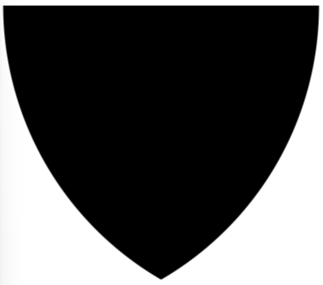

## 初识 mask？

> **mask 译为遮罩**
>
> mask 属性允许使用者通过 ***遮罩或者裁切*** 特定区域的图片的方式来 ***隐藏*** 一个元素的部分或者全部 ***可见区域***
>
> - mask的语法和background基本一致

#### 一个简单的背景图（mask版）

> **mask 允许使用者通过遮罩或者裁切特定区域的图片的方式来隐藏一个元素的部分或者全部可见区域**
>
> ***元素的内容**与 mask 生成的渐变的透明重叠部分，将会变得**透明***

```
.mask {  
      background: url("./img/1.jpg") no-repeat center / 100%;
+     mask: linear-gradient(90deg, transparent, #000);
+     -webkit-mask: linear-gradient(90deg, transparent, #000);
    }
```


#### 技巧一：使用 mask 进行内容裁切

```
.mask {
      width: 610px;
      height: 280px;
      background: url("./img/1.jpg") no-repeat center / 100%;
      -webkit-mask: linear-gradient(135deg, transparent 15px, deeppink 0) top
          left,
        linear-gradient(-135deg, transparent 15px, deeppink 0) top right,
        linear-gradient(-45deg, transparent 15px, deeppink 0) bottom right,
        linear-gradient(45deg, transparent 15px, deeppink 0) bottom left;
      -webkit-mask-size: 50.5% 50.5%;
      -webkit-mask-repeat: no-repeat;
    }
```


#### 实现内切圆角渐变色按钮

```
.mask-inset-circle {
      background: linear-gradient(45deg, #2179f5, #e91e63);
      -webkit-mask: radial-gradient(
          circle at 100% 100%,
          transparent 12px,
          #2179f5 13px
        ),
        radial-gradient(circle at 0 0, transparent 12px, #2179f5 13px),
        radial-gradient(circle at 100% 0, transparent 12px, #2179f5 13px),
        radial-gradient(circle at 0 100%, transparent 12px, #2179f5 13px);
      -webkit-mask-repeat: no-repeat;
      -webkit-mask-position: right bottom, left top, right top, left bottom;
      -webkit-mask-size: 70% 70%;
    }
```


#### 技巧二：巧用 mask 实现渐变消失布局

```
ul {
      width: 300px;
      display: flex;
      flex-wrap: nowrap;
      overflow-x: scroll;
      -webkit-mask: linear-gradient(90deg, red 60%, transparent);
    }
```


#### 技巧三：巧用 mask 实现融合效果

> 预留了从 `40%` 到 `60%`的从不透明到透明的过渡

```
    div {
      background: url("./img/1.jpg");
      position: relative;
    }
    div::after {
      content: "";
      position: absolute;
      top: 0; left: 0; right: 0; bottom: 0;
      background: url("./img/2.jpg");
      -webkit-mask: linear-gradient(45deg, #000 40%, transparent 60%);
    }
```


#### 技巧四：使用 mask 实现内容切换效果

> 切记： **尝试去理解这个属性被设计出来的目的，以及想要解决的问题** 。
>
> Mask 的核心就是遮罩，遮挡住元素的内容（可以是部分挡住，可以是逐渐消失，甚至是可以分块挡住），显示出其元素背后的内容。


#### 技巧五：`mask-composite` 组合遮罩大法，让切图更轻松

> 当一个元素存在多重 mask 时，我们就可以运用 `mask-composite` 进行效果叠加。
>
> 添加了 `-webkit-mask-composite: source-in` 后，我们就可以得到两个 mask 图形的重叠部分，再基于这个重叠部分作用到整个 mask 遮罩

```
    .original {
      width: 200px;
      height: 200px;
      background: #000;
      -webkit-mask: radial-gradient(
          circle at 100% 0,
          #000,
          #000 199px,
          transparent 200px
        ),
        radial-gradient(circle at 0 0, #000, #000 199px, transparent 200px);
      -webkit-mask-composite: source-in;
    }
```



`mask-composite`的其他妙用

```
{
    -webkit-mask-composite: clear; /*清除，不显示任何遮罩*/
    -webkit-mask-composite: copy; /*只显示上方遮罩，不显示下方遮罩*/
    -webkit-mask-composite: source-over; 
    -webkit-mask-composite: source-in; /*只显示重合的地方*/
    -webkit-mask-composite: source-out; /*只显示上方遮罩，重合的地方不显示*/
    -webkit-mask-composite: source-atop;
    -webkit-mask-composite: destination-over;
    -webkit-mask-composite: destination-in; /*只显示重合的地方*/
    -webkit-mask-composite: destination-out;/*只显示下方遮罩，重合的地方不显示*/
    -webkit-mask-composite: destination-atop;
    -webkit-mask-composite: xor; /*只显示不重合的地方*/
}
```

标准规范

```
{
    /* Keyword values */
    mask-composite: add;
    mask-composite: subtract;
    mask-composite: intersect;
    mask-composite: exclude;
}
```


