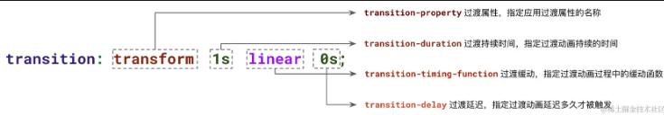

### 什么是 Web 动画

* **`屏幕刷新率：`** 设备显示器每秒绘制新图像的次数，其单位为赫兹 (Hz)。目前大多数设备为 60Hz。
* **`卡顿：`** 每个帧的预算时间仅比 `16毫秒` 多一点（`1秒/ 60 = 16.6毫秒`）。如果浏览器无法在这一帧内完成工作，则帧率将下降，可能导致跳帧，内容会在屏幕上抖动。此现象通常称为卡顿。
* **`跳帧：`** 假如浏览器动画分别在 16ms, 32ms, 48ms时分别切帧。等到了 32ms，浏览器其他任务还未完成，没有执行动画切帧。等到恢复动画切帧时，浏览器到了 48ms 的动画切帧。浏览器直接从16ms 处的画面 跳转到 48ms 处的画面，则发生了跳帧。

> **Web 动画本质是元素的外观样式或布局位置随着浏览器的逐帧绘制，以平滑的状态完成变化** 。
>
> 说白了就是一种"视觉欺骗"，浏览器在一段连续且很短的时间内，完成元素样式属性的变化

##### 一、动画的分类

* JS 动画
  * **setTimeout** / **setInterval** / **requestAnimationFrame**
  * **Web Animations API**
* CSS动画
  * **CSS Transition**：**补间动画**，设置关键帧的初始状态与结束状态，比如大小、颜色、透明度等，浏览器将自动根据二者之间帧的值创建的动画
  * **CSS Animation**：`CSS Transition` 的加强版，即是 **补间动画** 又是 **逐帧动画**

### transition 基础讲解

##### 一、释义

> transition 属性用于指定为一个或多个 CSS 属性添加过渡效果。以控制元素的某个属性值从状态 A 经由动画效果，变化到状态 B。

##### 二、基础内容

|     属性     |         transition         |                          取值                          |
| :----------: | :------------------------: | :-----------------------------------------------------: |
|     名称     |    transition-property    |                 <过渡属性的名称\| all>                 |
|   持续时间   |    transition-duration    |                         s 和 ms                         |
|   运动函数   | transition-timing-function | ease\ease-in\ease-out\liinear\cubic-bezier(x1,y1,x2,y2) |
| 过渡延迟时间 |      transition-delay      |                         s 和 ms                         |
|              |                            |                                                        |

顺序要求：只有俩时间有先后顺序，[ 持续时间, 过渡延迟时间 ]



##### 三、细节

1. ***all***  可以给所有属性设置过渡

   > 关键字：`all `，是 `transition-property` 的一个特殊的值，将元素下任何支持过渡的属性都将被赋予过渡效果
   >

   注意：后期对代码的维护过程中，如果出现一个属性不需要过渡效果，那么需要重写整段 `transition` 代码，并且很有可能造成遗漏
2. 多个属性的精细化控制

   > 一次精细化地定义多个不同的过渡效果。分别设置不同的过渡时长、缓动效果以及延迟时间
   > 效果间用 ，分格
   >

   ```css
   {
       // 可以这样
       transition: all 1s linear;

       // 也可以这样
       transition: 
           height 1s linear, 
           transform 0.5s,
           color 2s ease-in-out 0.5s;
   }
   ```
3. 过渡效果支持延迟加载

   > 与 CSS 的 Animation 一样，过渡也是支持延迟触发的
   >
4. 并非所有元素都是支持过渡动画的

   > 一般 颜色、背景色、字体大小、位置、尺寸等等 都支持动画
   >
   > 但是如 字体的变化，背景色渐变效果就不支持
   >

##### 四、不要将auto值应用于过渡动画

> `auto` 值常常较复杂, 不同浏览器有不动的表现形式，取决于浏览器及其版本，所以要避免使用
>
> 因此，某些属性在特定的情况下也是不支持transition的，如height: auto `和`width: auto

列子：实现元素高度过渡

##### 五、巧用多层元素，解决交互闪烁问题

##### 六、巧用延时过渡，让内容保持状态

例子：在按钮的旁边，有一个菜单，每次 hover 按钮的时候，菜单就会出现，每次当我们的鼠标想去到菜单界面的时候，由于我们的鼠标离开了按钮区域，导致出现了的菜单又消失不见。使用 `transition-delay` 延迟菜单的消失，就是一种非常好的做法。

> 当鼠标 hover 到按钮，触发 `hover` 伪类，元素的 `transition-delay` 设置为了 `0s`，`opacity` 过渡动画会立即触发，因此菜单会立即显现
>
> 而当鼠标离开 Button 按钮，`hover` 伪类失效，此时元素的 `transition-delay` 设置为了 `1s`，所以菜单会等待 1 秒之后才进行复位过渡动画，因此菜单不会立即消失

##### 七、巧用延迟过渡，实现多段过渡动画的组合

> **这里的核心在于通过元素先高度后宽度的变化，让两条 border 的出现是有先后顺序感的**
>
> **通过** **`transition-delay`** **，我们精细化地控制了不同属性，通过时间先后的展示，最终组合得到各种有趣的效果**。


##### 八、transition-duration 0 与非 0 切换的效果

> 核心：
>
> * 交互触发动画时，设置一个***非常短***，甚至 ***0s*** 的过渡持续时间 `transition-duration`
> * 动画复位时，再设置一个 ***非常非常长***  的过渡持续时间 `transition-duration`，将元素保持咋i动画状态下
