## CSS 动画介绍及语法

> CSS 动画可以实现元素从一个 CSS 样式的配置转换到另一个 CSS 样式配置，也就是实现样式 A 到样式 B 的切换。
>
> 动画实现的核心概念：
>
> * **`animation` 属性** ：用于将动画序列应用到指定的元素上，可以控制动画的各种属性，例如持续时间、循环次数、动画方向等等
> * **`@keyframes` 规则** ：用于定义动画序列中不同时间点的样式，可以将动画拆分为多个关键帧（keyframe），每个关键帧指定一个时间点和对应的样式
>
> `CSS Transition` 的加强版，即是 **补间动画** 又是 **逐帧动画**

##### animation属性（拆开写，有顺序要求）

|                  属性                  | animation                           |                          取值                          |
| :------------------------------------: | ----------------------------------- | :-----------------------------------------------------: |
|   由**@Keyframes** 描述的关键帧名称   | ***animation-name***  必须 |                  @Keyframes创建的名称                  |
|           动画一个周期的时长           | ***animation-duration *** 必须     |                  `<number> s or ms`                  |
|                动画延时                | animation-delay                     |                  `<number> s or ms`                  |
|        每个周期内动画运动的方向        | animation-direction                 |    【normal，reverse，alternate，alternate-reverse】    |
|              动画重复次数              | animation-iteration-count           |                默认1次，infinite(无限次)                |
|           允许暂停和恢复动画           | animation-play-state                |               running(播放)、paused(暂停)               |
|                速度曲线                | animation-timing-function           | ease\ease-in\ease-out\liinear\cubic-bezier(x1,y1,x2,y2) |
| 指定动画执行前后如何为目标元素应用样式 | animation-fill-mode                 |           【none、forwards、backwards、both】           |
|           多个动画的合成方式           | animation-composition               |              【replace、add、accumulate】              |

> animation-direction：***normal***(正向播放动画)、***reverse***(反向播放动画)、***alternate***(动画从***正向***开始来回播放)、***alternate-reverse***(动画从***反向***开始来回播放)
>
> animation-fill-mode：none(动画完成返回原状态)、forwards(动画完成保持最后状态)、backwards(动画等待保持原状态)、both(动画等待保持最后状态)
>
> animation-composition：replace(动画会覆盖原有属性。这是默认值)、add(动画追加到原有属性后面)、accumulate(动画与原有属性进行混合)

##### 动画 animation 与过渡 transition 的异同

| 相同点           | 1. CSS 的 animation 和 transition 均能够对元素的样式和行为进行修改，使其产生动态效果<br />2. 两者都需要设置初始状态和结束状态，并且在之间进行过渡或动画过程。<br />3. 用于改善用户体验，增加页面的交互性和吸引力                                                                                                                                                                                                                                                                                                                                                                          |
| ---------------- | :----------------------------------------------------------------------------------------------------------------------------------------------------------------------------------------------------------------------------------------------------------------------------------------------------------------------------------------------------------------------------------------------------------------------------------------------------------------------------------------------------------------------------------------------------------------------------------------- |
| **不同点** | 1. 实现方式不同：animation 是通过连续播放多帧图像来实现动态效果，而 transition 则是通过平滑过渡来实现元素样式的变化。<br />2. 动画方式不同：animation 可以根据关键帧设置进行循环播放、反向播放、暂停等复杂操作，<br />    而 transition 只能实现简单的从一种状态到另一种状态的平滑过渡。<br />3. 触发方式不同：transition 更多的需要通过手动触发，而 animation 不但可以手动触发，也可以默认进行播放<br />4. 适用场景不同：animation 更适合用于实现复杂动态效果，如 loading 动画、动态图表等；<br />    而 transition 更适用于简单的元素样式变化，如 hover 状态下颜色和大小的变化等。 |

> 总的来说，animation 和 transition 都是 CSS 中常用的动态效果实现方式，但是它们在实现方式、动画方式、触发方式和适用场景等方面存在一些不同。在实际应用中，需要根据具体的需求和效果来选择合适的实现方式。


##### animation-name / animation-duration 详解

> 通过 `animation-name`，CSS 引擎将会找到对应的 **[@keyframes]()** 规则。
>
> 和 CSS class/id 选择器的规则命名一样，`animation-name` 的命名也存在一些骚操作；譬如，它是支持 emoji 表情的，所以代码中的 `animation-name` 命名也可以这样写：

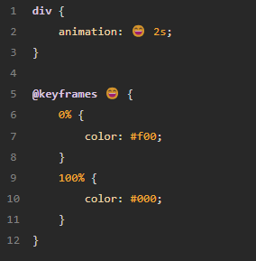

##### animation-delay 详解

> `animation-delay`用于设置动画的延时，即从元素加载完成之后到动画序列开始执行的这段时间。
>
> ***animation-delay 的值可以为负值***

例子：小球loading动画

> 思路：初始 3 个球的位置就是间隔 120°，同时开始旋转，但是这样代码量会稍微多一点
>
> * 另外一种思路，同一个动画，3 个元素的其中两个延迟整个动画的 1/3，2/3 时间出发

```
div > span:nth-child(1) {
      animation: rotate 3s linear infinite;
    }
    div > span:nth-child(2) {
      animation: rotate 3s -1s linear infinite;
    }
    div > span:nth-child(3) {
      animation: rotate 3s -2s linear infinite;
    }
```

利用 animation-duration 和 animation-delay 构建随机效果

例子：10个小球随机上升

```scss
@for $i from 1 to 11 {
    li:nth-child(#{$i}) {
        animation-duration: #{random(2000)/1000 + 2}s;
        animation-delay: #{random(1000)/1000 + 1}s;
    }
}
```


##### animation-timing-function 缓动函数

> 缓动函数在动画中非常重要，它定义了动画在每一动画周期中执行的节奏。
>
> 分俩类：
>
> 1. cubic-bezier-timing-function，三次贝塞尔曲线缓动函数  https://link.juejin.cn/?target=https%3A%2F%2Fcubic-bezier.com%2F%23.25%2C.1%2C.25%2C1
> 2. step-timing-function，逐步动画

> 许多精益求精的动画，在设计中其实都考虑到了缓动函数。（动画的设计依据实际在生活中的表现去考量）

例子：时钟动画

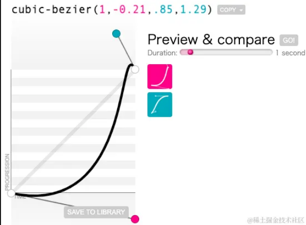

##### 步骤缓动函数

```css
{
    animation-timing-function: steps(6, start)
    animation-timing-function: steps(4, end);
}
```

> 使用步骤缓动函数最多的，就是利用其来实现逐帧动画。
>
> 有这样一张图, 可以发现它其实是一个人物行进过程中的 6 种状态，或者可以为 6 帧，我们利用 `animation-timing-function: steps(6)` 可以将其用一个 CSS 动画串联起来

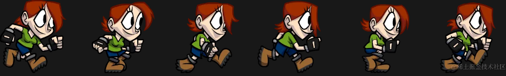

```css
.box {
  width: 256px;
  height: 256px;
  background: url('img');
  animation: sprite .6s steps(6, end) infinite;
}
@keyframes sprite {
  0% { 
    background-position: 0 0;
  }
  100% { 
    background-position: -1536px 0;
  }
}
```

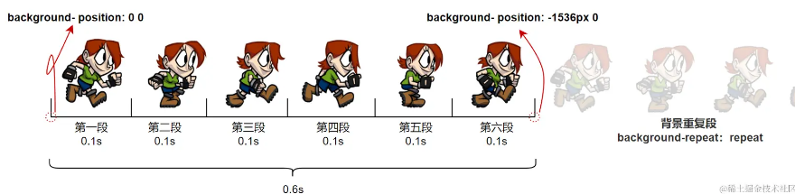

> 在动画过程中，`background-position` 的取值其实只有 `background-position: 0 0`、`background-position: -256px 0`、`background-position: -512px 0` ……依次类推一直到 `background-position: -1536px 0`，由于背景的 repeat 的特性，其实刚好回到原点，由此又重新开始新一轮同样的动画。

##### animation-duration 动画长短对动画的影响

> `animation-duration` 动画长短对动画的影响也是非常明显的
>
> 上述代码的基础上，我们再修改 `animation-duration`，缩短每一帧的时间就可以让步行的效果变成跑步的效果；同理，也可以增加每一帧的停留时间，让每一步变得缓慢，就像是在步行一样
>
> ***需要提出的是，上文说的每一帧，和浏览器渲染过程中的 FPS 的每一帧不是同一个概念。***

##### 复杂的 `steps` 语法 ?

1. `steps(6)`；
2. `steps(6, start)`；
3. `steps(6, end)`；
4. `steps(6, jump-start)`；
5. `steps(6, jump-end)`；
6. `steps(6, jump-none)`；
7. `steps(6, jump-both)`。

> 其核心就在于控制动画的关键帧如何进行跳跃，尤其是对动画首尾的一些处理上，经常容易出现问题
>
> * **`jump-start`** **与** **`start`** **的作用类似：** 表示第一次跳跃发生在动画开始时。
> * **`jump-end`** **与** **`end`** **作用类似：** 表示最后一次跳转发生在动画结束时。
> * **`jump-none`** **：** 它将对象保持在 0% 标记和 100% 标记处，每个持续时间的 1/n。
> * **`jump-both`** **：** 包括在 0% 和 100% 标记处的暂停，有效地在动画迭代期间添加一个步骤。
>
> 当我们实际需要使用 `steps()` 语法去控制动画的时候，当遇到首尾动画衔接、首尾动画停留问题，通常都可以借助以上的一些关键字解决。

##### 同个动画效果的补间动画和逐帧动画演绎对比

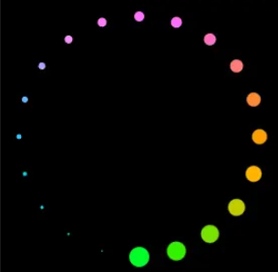

> 要实现一个上面这种loading效果。上述的三次贝塞尔曲线缓动和步骤缓动，其实就是对应的补间动画和逐帧动画
>
> 如果利用补间动画，也就是三次贝塞尔曲线缓动的话，让它旋转起来，得到的效果非常的一般
>
> 我们将补间动画换成逐帧动画，因为有 20 个点，所以设置成 steps(20)，再看看效果，会得到完全不一样的感觉

```css
.g-container{
    animation: rotate 2s steps(20) infinite;
}
@keyframes rotate {
    0% {
        transform: rotate(0);
    }
    100% {
        transform: rotate(360deg);
    }
}
```


##### animation-play-state

> 它可以控制动画的状态 ——** *运行或者暂停***，类似于视频播放器的开始和暂停。这是 CSS 动画中*有限的控制动画状态*的手段之一
>
> 在非常多 Web 创意交互动画中我们都可以看到这个技巧的身影。
>
> 1. 页面 render 后，无任何操作，动画不会开始。只有当鼠标对元素进行 `click` ，通过触发元素的 `:active` 伪类效果的时候，赋予动画 `animation-play-state: running`，动画才开始进行。
> 2. 动画进行到任意时刻，鼠标停止点击，伪类消失，则动画停止


##### animation-fill-mode 控制元素在各个阶段的状态

> `animation-fill-mode` 属性，意为设置 CSS 动画在执行之前和之后如何将样式应用于其目标。
>
> 1. `animation-fill-mode: none`：默认值，当动画***未执行时***，动画将不会将任何样式应用于目标，而是使用赋予给该元素的 ***CSS 规则***来显示该元素的状态。
> 2. `animation-fill-mode: backwards`：动画将在应用于目标时***立即应用***第一个关键帧中定义的值，并在 animation-delay 期间保留此值。
> 3. `animation-fill-mode: forwards`：目标将***保留由执行期间遇到的最后一个关键帧***计算值。 最后一个关键帧取决于 animation-direction 和 animation-iteration-count。
> 4. `animation-fill-mode`：动画将遵循 forwards 和 backwards 的规则，从而在两个方向上扩展动画属性。

> 1. 元素在动画时间之外，样式只受到它的 CSS 规则限制，与 **[@Keyframes](https://link.juejin.cn/?target=https%3A%2F%2Fgithub.com%2FKeyframes "https://github.com/Keyframes")** 内的关键帧定义无关。

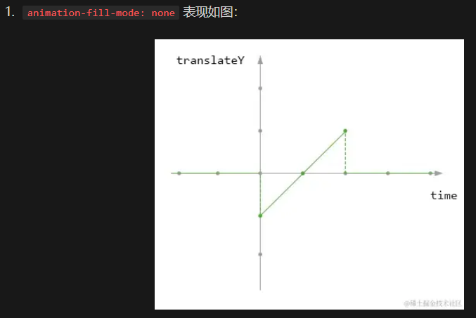

> 2. 元素在动画开始之前（包含未触发动画阶段及 `animation-delay` 期间）的样式为动画运行时的第一帧，而动画结束后的样式则恢复为 CSS 规则设定的样式。

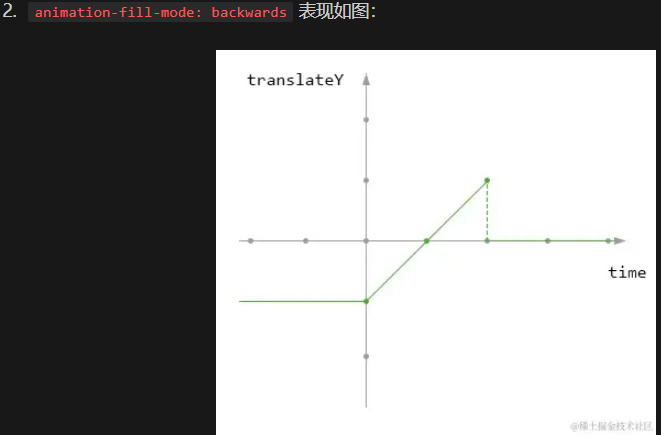

> 3. 元素在动画开始之前的样式为 CSS 规则设定的样式，而动画结束后的样式则表现为由执行期间遇到的最后一个关键帧计算值（也就是停在最后一帧）

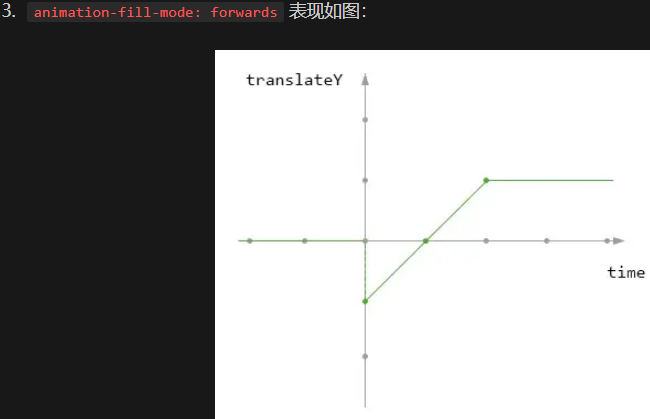

> 综合了 `animation-fill-mode: backwards` 和 `animation-fill-mode: forwards` 的设定。动画开始前的样式为动画运行时的第一帧，动画结束后停在最后一帧。

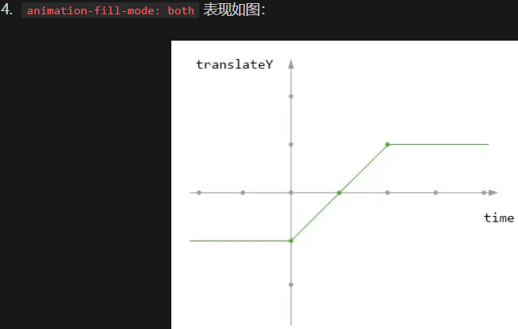

例子：进一步理解 `animation-fill-mode` 的各个状态

> 1. 动画的 `@keyframes` 关键帧之外，有给元素设置默认的 `left: -40px`；
> 2. 动画的 `@keyframes` 关键帧的 `0%`，给元素设置默认的 `left: 0`；
> 3. 动画的 `@keyframes` 关键帧的 `100%`，给元素设置默认的 `left: 100%`

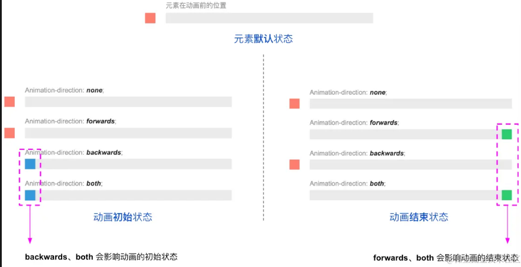

> 总结：
>
> 1. **backwards、both** 会影响动画的初始状态；
> 2. **forwards、both** 会影响动画的结束状态。


##### animation-iteration-count/animation-direction 动画循环次数和方向

* `animation-iteration-count` 控制动画运行的次数，可以是数字或者 `infinite`，注意，***数字可以是小数***。
* `animation-direction` 控制动画的方向，正向、反向、正向交替与反向交替。

> 讲述 `animation-fill-mode` 时，我使用了**动画运行时的第一帧**替代了 **[@Keyframes](https://link.juejin.cn/?target=https%3A%2F%2Fgithub.com%2FKeyframes "https://github.com/Keyframes")** 中定义的第一帧这种说法
>
> 因为动画运行的第一帧和最后一帧的实际状态还会受到动画运行方向 `animation-direction` 和 `animation-iteration-count` 的影响

在 CSS 动画中，由 `animation-iteration-count` 和 `animation-direction` 共同决定动画运行时的第一帧和最后一帧的状态。

> 1. 动画运行的第一帧由 `animation-direction` 决定。
> 2. 动画运行的最后一帧由 `animation-iteration-count` 和 `animation-direction` 决定。

例子：设置一个 `100px x 100px` 的滑块，在一个 `400px x 100px` 的容器中，解释下 `animation-fill-mode: backwards` 和 `animation-direction` 的关系

```css
.g-box {
    ...
    animation: move 4s linear;
    animation-play-state: paused;
    transform: translate(0, 0);
}
@keyframes move {
    0% {
        transform: translate(100px, 0);
    }
    100% {
        transform: translate(300px, 0);
    }
}
```

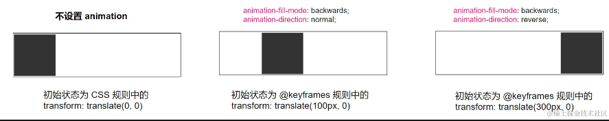


##### keyframes 规则的设定

```css
@keyframes fadeIn {
    0% {
        opacity: 1;
    }
    100% {
        opacity: 0;
    }
}

@keyframes fadeIn {
    from {
        opacity: 1;
    }
    to {
        opacity: 0;
    }
}
```

> 在 CSS 动画 `@keyframes` 的定义中，`from` 等同于 `0%`，而 `to` 等同于 `100%`。动画关键帧不止俩帧时推荐用百分比

除此之外，当动画的起始帧等同于 CSS 规则中赋予的值并且没有设定 `animation-fill-mode`，`0%` 和 `from` 这一帧是可以删除的。
