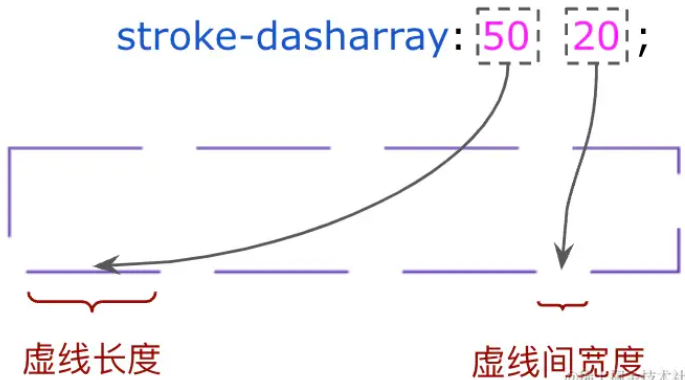
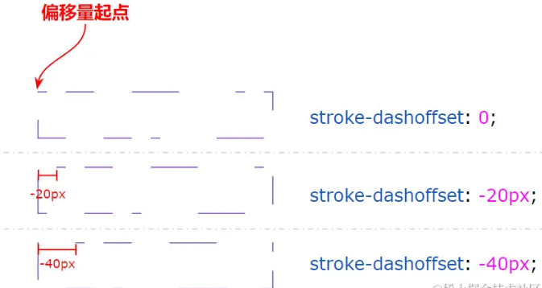
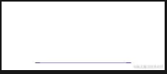

##### SVG 快速入门

一、svg的优势

> 1. **可无限缩放** ：SVG 是矢量图形，相比于位图能够保证图像质量，在不同尺寸下不会出现失真。
> 2. **体积小** ：与 JPG 和 PNG 等图像格式不同，SVG 文件仅是由一个特定的 XML 源代码组成，因此它们在文件大小和下载速度方面具有优势。
> 3. **易于编辑** ：由于 SVG 是基于文本的 XML 格式，因此可以通过编辑 SVG 代码轻松地修改图像。
> 4. **支持动画和交互** ：SVG 可以使用 JavaScript 来创建动态图像，并且可以为 SVG 图像添加事件处理程序和链接，使其具有更多的交互性。

二、基本形状绘制

> 一些常规的形状： 矩形、圆形、椭圆、线条、折线、多边形
>
> SVG 的 PATH 属性绘制一些复杂图形：二次贝塞尔曲线、三次贝塞尔曲线

例子：绘制一个矩形

```svg
 <svg height="100%" width="100%" xmlns="http://www.w3.org/2000/svg">
    <rect width="250" height="50" stroke="#673ab7" stroke-width="2" fill="transparent" />
  </svg>
```


##### SVG 图形与 CSS 之间的桥梁

> 可以通过 CSS 样式去控制 SVG 元素的表现

比如上面的 rect 中的代码就等价于

```css
<svg height="100%" width="100%" xmlns="http://www.w3.org/2000/svg">
  <rect class="rect"/>
</svg>

.rect {
  width: 250px;
  height: 50px;
  stroke: #673ab7;
  stroke-width: 2;
  fill: transparent;
}
```

> 并且 svg 部分属性是支持 CSS 过渡与动画效果的


##### SVG 线条动画

> * `stroke-dasharray`：值是一组数组，没数量上限，每个数字交替表示边框与间隔的宽度；
>
> * `stroke-dashoffset`：表示的是边框线的偏移量。

> dashed 可以实现虚线，但是，每段虚线的长度、每段虚线线段的长度是无法控制的。SVG 中利用 `stroke-dasharray` 就可以进行控制



> 默认情况下，虚线的起点位于路径的起点处，但是通过改变 `stroke-dashoffset` 值，可以让虚线从路径的其他位置开始绘制




##### 规则图形的 SVG 路径线条动画

> 通过 `stroke-dasharray: 100 500` 设置虚线边框的规则，线段部分为 `100px`，间隔部分为 `500px`
>
> 由于元素的高宽为 `250px` 和 `50px`，因此周长就是 `600px`，在 `stroke-dasharray: 100 500` 的规则下，只能看到一条线段
>
> 再通过 `stroke-dashoffset: 225` 把唯一的边框线段调整到我们想要的位置。



```html
 <div class="container">
    <svg height="100%" width="100%" xmlns="http://www.w3.org/2000/svg">
        <rect class="rect" />
    </svg>
 </div>

  .rect {
    width: 250px;
    height: 50px;
    stroke: #673ab7;
    stroke-width: 1px;
    fill: transparent;
    stroke-dasharray: 100 500;
    stroke-dashoffset: 225;
  }
```
